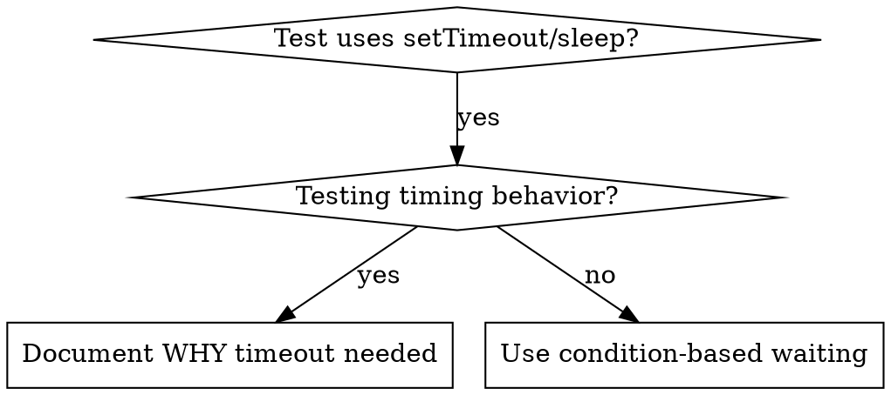

<!-- kit patch: provenance note -->
> Vendored from obra/superpowers@8ca22db (v6.4.2) by Jesse Vincent, MIT — licence in `LICENSES/superpowers-LICENSE`.
> Local changes are marked `<!-- kit patch: … -->` … `<!-- /kit patch -->`. Examples are translated to Python.
<!-- /kit patch -->

# Condition-Based Waiting

## Overview

Flaky tests often guess at timing with arbitrary delays. This creates race conditions where tests pass on fast machines but fail under load or in CI.

**Core principle:** Wait for the actual condition you care about, not a guess about how long it takes.

## When to Use



**Use when:**
- Tests have arbitrary delays (`setTimeout`, `sleep`, `time.sleep()`)
- Tests are flaky (pass sometimes, fail under load)
- Tests timeout when run in parallel
- Waiting for async operations to complete

**Don't use when:**
- Testing actual timing behavior (debounce, throttle intervals)
- Always document WHY if using arbitrary timeout

<!-- kit patch: where this typically bites -->
**Typical places:** background jobs whose status the page polls, UI automation scripts with fixed sleeps between
steps, and message queues. In the built-in browser, re-check with `find` / `get_page_text` for the expected element
or text instead of a blind wait.
<!-- /kit patch -->

## Core Pattern

<!-- kit patch: example translated to Python -->
```python
# ❌ BEFORE: Guessing at timing
time.sleep(0.05)
result = get_result()
assert result is not None

# ✅ AFTER: Waiting for condition
wait_for(lambda: get_result() is not None, "result available")
result = get_result()
assert result is not None
```
<!-- /kit patch -->

## Quick Patterns

<!-- kit patch: patterns translated to Python -->
| Scenario | Pattern |
|----------|---------|
| Wait for event | `wait_for(lambda: next((e for e in events if e["type"] == "DONE"), None), "DONE event")` |
| Wait for state | `wait_for(lambda: job_status(job_id) == "done", "job done")` |
| Wait for count | `wait_for(lambda: len(items) >= 5, "5 items")` |
| Wait for file | `wait_for(lambda: path.exists(), f"{path} exists")` |
| Complex condition | `wait_for(lambda: obj.ready and obj.value > 10, "obj ready")` |
| Selenium element | `WebDriverWait(driver, 20).until(EC.visibility_of_element_located((By.ID, "x")))` |
<!-- /kit patch -->

## Implementation

Generic polling function:
<!-- kit patch: implementation translated to Python; the upstream .ts example file is not vendored -->
```python
import time

def wait_for(condition, description, timeout_s=5.0, interval_s=0.01):
    deadline = time.monotonic() + timeout_s
    while True:
        result = condition()
        if result:
            return result
        if time.monotonic() > deadline:
            raise TimeoutError(f"Timeout waiting for {description} after {timeout_s}s")
        time.sleep(interval_s)  # poll every 10 ms
```
<!-- /kit patch -->

## Common Mistakes

<!-- kit patch: inline example translated to Python -->
**❌ Polling too fast:** `time.sleep(0.001)` - wastes CPU
**✅ Fix:** Poll every 10ms
<!-- /kit patch -->

**❌ No timeout:** Loop forever if condition never met
**✅ Fix:** Always include timeout with clear error

**❌ Stale data:** Cache state before loop
**✅ Fix:** Call getter inside loop for fresh data

## When Arbitrary Timeout IS Correct

<!-- kit patch: example translated to Python -->
```python
# Tool ticks every 100 ms - need 2 ticks to verify partial output
wait_for_event(manager, "TOOL_STARTED")  # First: wait for condition
time.sleep(0.2)                          # Then: wait for timed behavior
# 200 ms = 2 ticks at 100 ms intervals - documented and justified
```
<!-- /kit patch -->

**Requirements:**
1. First wait for triggering condition
2. Based on known timing (not guessing)
3. Comment explaining WHY

## Real-World Impact

From debugging session (2025-10-03):
- Fixed 15 flaky tests across 3 files
- Pass rate: 60% → 100%
- Execution time: 40% faster
- No more race conditions
