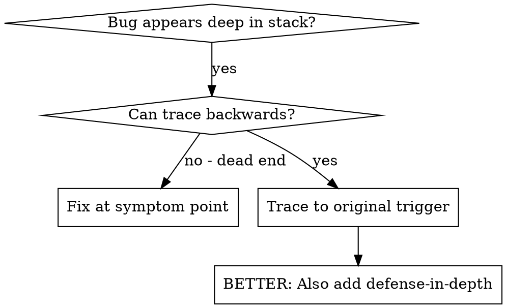
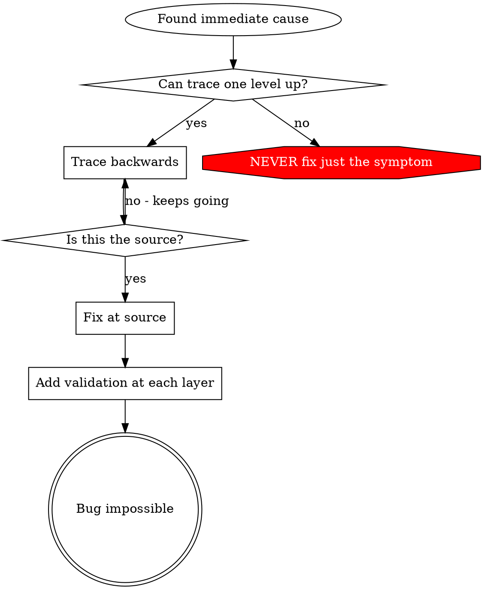

<!-- kit patch: provenance note -->
> Vendored from obra/superpowers@8ca22db (v6.4.2) by Jesse Vincent, MIT — licence in `LICENSES/superpowers-LICENSE`.
> Local changes are marked `<!-- kit patch: … -->` … `<!-- /kit patch -->`. The worked example keeps its upstream
> TypeScript; the instrumentation and commands are Python/pytest.
<!-- /kit patch -->

# Root Cause Tracing

## Overview

Bugs often manifest deep in the call stack (git init in wrong directory, file created in wrong location, database opened with wrong path). Your instinct is to fix where the error appears, but that's treating a symptom.

**Core principle:** Trace backward through the call chain until you find the original trigger, then fix at the source.

## When to Use



**Use when:**
- Error happens deep in execution (not at entry point)
- Stack trace shows long call chain
- Unclear where invalid data originated
- Need to find which test/code triggers the problem

## The Tracing Process

### 1. Observe the Symptom
```
Error: git init failed in ~/project/packages/core
```

### 2. Find Immediate Cause
**What code directly causes this?**
```typescript
await execFileAsync('git', ['init'], { cwd: projectDir });
```

### 3. Ask: What Called This?
```typescript
WorktreeManager.createSessionWorktree(projectDir, sessionId)
  → called by Session.initializeWorkspace()
  → called by Session.create()
  → called by test at Project.create()
```

### 4. Keep Tracing Up
**What value was passed?**
- `projectDir = ''` (empty string!)
- Empty string as `cwd` resolves to `process.cwd()`
- That's the source code directory!

### 5. Find Original Trigger
**Where did empty string come from?**
```typescript
const context = setupCoreTest(); // Returns { tempDir: '' }
Project.create('name', context.tempDir); // Accessed before beforeEach!
```

## Adding Stack Traces

When you can't trace manually, add instrumentation:

<!-- kit patch: instrumentation translated to Python; no personal data -->
```python
import os, sys, traceback

# DBG: before the problematic operation. Log shapes and context, never user values.
def render_invoice(order_id, fields):
    print(
        "DBG render_invoice",
        {"order_id": order_id, "field_keys": sorted(fields), "cwd": os.getcwd()},
        "".join(traceback.format_stack(limit=12)),
        file=sys.stderr,
    )
    ...
```

**Critical:** In tests, write to `sys.stderr` and run pytest with `-s` (or read the "Captured stderr" section);
app loggers may be filtered.

**Run and capture:**
```bash
<your test command> tests/<file>.py -s 2>&1 | grep 'DBG render_invoice'
```
<!-- /kit patch -->

**Analyze stack traces:**
- Look for test file names
- Find the line number triggering the call
- Identify the pattern (same test? same parameter?)

## Finding Which Test Causes Pollution

If something appears during tests but you don't know which test:

<!-- kit patch: find-polluter.sh is not vendored; pytest equivalent -->
Bisect with pytest in your local environment: run one test file at a time and stop at the first that leaves the
artefact behind (a stray file, a Redis key, a mutated module-level dict).

```bash
sh -c '
  for f in tests/test_*.py; do
    python -m pytest "$f" -q -p no:cacheprovider >/dev/null 2>&1
    [ -e "<artefact-path>" ] && { echo "POLLUTER: $f"; break; }
  done'
```

For order-dependent failures, run the failing test after halves of the suite
(`python -m pytest <first-half files> tests/<failing>.py -q`) and keep halving.
<!-- /kit patch -->

## Real Example: Empty projectDir

**Symptom:** `.git` created in `packages/core/` (source code)

**Trace chain:**
1. `git init` runs in `process.cwd()` ← empty cwd parameter
2. WorktreeManager called with empty projectDir
3. Session.create() passed empty string
4. Test accessed `context.tempDir` before beforeEach
5. setupCoreTest() returns `{ tempDir: '' }` initially

**Root cause:** Top-level variable initialization accessing empty value

**Fix:** Made tempDir a getter that throws if accessed before beforeEach

**Also added defense-in-depth:**
- Layer 1: Project.create() validates directory
- Layer 2: WorkspaceManager validates not empty
- Layer 3: NODE_ENV guard refuses git init outside tmpdir
- Layer 4: Stack trace logging before git init

## Key Principle



**NEVER fix just where the error appears.** Trace back to find the original trigger.

## Stack Trace Tips

<!-- kit patch: tips translated to Python; personal-data rule -->
**In tests:** Use `print(..., file=sys.stderr)` with `pytest -s`, not the app logger — it may be filtered
**Before operation:** Log before the dangerous operation, not after it fails
**Include context:** Record id, step, field *keys*, cwd, config *presence*, timestamps — never user values or secrets
**Capture stack:** `traceback.format_stack()` shows the complete call chain
<!-- /kit patch -->

## Real-World Impact

From debugging session (2025-10-03):
- Found root cause through 5-level trace
- Fixed at source (getter validation)
- Added 4 layers of defense
- 1847 tests passed, zero pollution
