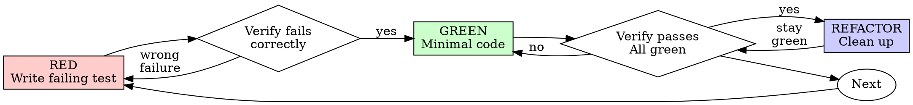

<!-- kit patch: provenance note; description sharpened (upstream: "Use when implementing any feature or bugfix, before writing implementation code") -->
> Vendored from obra/superpowers@8ca22db (v6.4.2) by Jesse Vincent, MIT — licence in `LICENSES/superpowers-LICENSE`.
> Local changes are marked `<!-- kit patch: … -->` … `<!-- /kit patch -->`. Examples are in Python/pytest; the method
> is language-agnostic. Replace `<your test command>` with the project's command (see `CLAUDE.md`).
<!-- /kit patch -->

# Test-Driven Development (TDD)

## Overview

Write the test first. Watch it fail. Write minimal code to pass.

**Core principle:** If you didn't watch the test fail, you don't know if it tests the right thing.

**Violating the letter of the rules is violating the spirit of the rules.**

## When to Use

**Always:**
- New features
- Bug fixes
- Refactoring
- Behavior changes

**Exceptions (ask your human partner):**
- Throwaway prototypes
- Generated code
- Configuration files

<!-- kit patch: subagents cannot ask -->
In a subagent or Workflow stream you cannot ask: stop and return `BLOCKED: <question>` in your report.
<!-- /kit patch -->

Thinking "skip TDD just this once"? Stop. That's rationalization.

## The Iron Law

```
NO PRODUCTION CODE WITHOUT A FAILING TEST FIRST
```

Write code before the test? Delete it. Start over.

**No exceptions:**
- Don't keep it as "reference"
- Don't "adapt" it while writing tests
- Don't look at it
- Delete means delete

<!-- kit patch: scope of "delete" -->
"Delete" means code **you** wrote in this cycle on **your own** branch. Never delete other people's or other
streams' code, and never touch read-only reference code.
<!-- /kit patch -->

Implement fresh from tests. Period.

## Red-Green-Refactor



### RED - Write Failing Test

Write one minimal test showing what should happen.

<!-- kit patch: examples translated from TypeScript/Jest to Python/pytest (same content) -->
<Good>
```python
def test_retries_failed_operation_three_times():
    attempts = 0

    def operation():
        nonlocal attempts
        attempts += 1
        if attempts < 3:
            raise RuntimeError("fail")
        return "success"

    assert retry_operation(operation) == "success"
    assert attempts == 3
```
Clear name, tests real behavior, one thing
</Good>

<Bad>
```python
def test_retry_works():
    op = Mock(side_effect=[RuntimeError(), RuntimeError(), "success"])
    retry_operation(op)
    assert op.call_count == 3
```
Vague name, tests mock not code
</Bad>
<!-- /kit patch -->

**Requirements:**
- One behavior
- Clear name
- Real code (no mocks unless unavoidable)

### Verify RED - Watch It Fail

**MANDATORY. Never skip.**

<!-- kit patch: neutral test command -->
```bash
<your test command> tests/test_retry.py
```

Run it in `<your local environment>`, never against shared or production services. If the test setup loads a real
`.env`, make sure it cannot reach anything but local resources.
<!-- /kit patch -->

Confirm:
- Test fails (not errors)
- Failure message is expected
- Fails because feature missing (not typos)

**Test passes?** You're testing existing behavior. Fix test.

**Test errors?** Fix error, re-run until it fails correctly.

### GREEN - Minimal Code

Write simplest code to pass the test.

<!-- kit patch: examples translated to Python -->
<Good>
```python
def retry_operation(fn):
    for attempt in range(3):
        try:
            return fn()
        except Exception:
            if attempt == 2:
                raise
```
Just enough to pass
</Good>

<Bad>
```python
def retry_operation(fn, max_retries=3, backoff="linear", on_retry=None):
    ...  # YAGNI
```
Over-engineered
</Bad>
<!-- /kit patch -->

Don't add features, refactor other code, or "improve" beyond the test.

### Verify GREEN - Watch It Pass

**MANDATORY.**

```bash
<your test command> tests/test_retry.py
```

Confirm:
- Test passes
- Other tests still pass
- Output pristine (no errors, warnings)

**Test fails?** Fix code, not test.

**Other tests fail?** Fix now.

**"Other tests" means the project's suite, not just your file.** A
green run of the test you wrote is not a green suite. Before you call
the change done, run the project's test command (bare `pytest`,
`npm test`, `cargo test` — whatever the repo uses) even when your task
named only one test file. A scope statement in your task bounds the
deliverable, not your verification. Any failure that run shows —
including one you didn't cause — goes in your report by name; a red
test you watched scroll past and didn't mention is a report falsified
by omission.

<!-- kit patch: full-suite evidence -->
Quote the full suite's final count line verbatim in your report.
<!-- /kit patch -->

### REFACTOR - Clean Up

After green only:
- Remove duplication
- Improve names
- Extract helpers

Keep tests green. Don't add behavior.

### Repeat

Next failing test for next feature.

<!-- kit patch: commit policy -->
### Commits

- Commit at green checkpoints **only on your own branch**: the stream branch or worktree named in your brief, or the
  feature branch the user named. Never commit to the default branch or another stream's branch.
- Stage only files your PRD owns; `git diff --name-only` must be a subset of the PRD's "Owned files".
- **Never push, merge into a shared branch, open a PR or run deploy scripts.** The guard hook
  (`.claude/hooks/guard-bash.sh`) blocks them; a human pushes from the hand-off note
  (`.SDD/templates/handoff-note.md`).
- Commit only green. Record RED evidence (the failing line, verbatim) in your report instead of committing red.
<!-- /kit patch -->

## Good Tests

<!-- kit patch: test names in the table translated to pytest style -->
| Quality | Good | Bad |
|---------|------|-----|
| **Minimal** | One thing. "and" in name? Split it. | `test_validates_email_and_domain_and_whitespace` |
| **Clear** | Name describes behavior | `test_1` |
| **Shows intent** | Demonstrates desired API | Obscures what code should do |
<!-- /kit patch -->

When writing or changing any test, read [writing-good-tests.md](writing-good-tests.md) for the rules that keep tests honest:
- Name the production change that would make the test fail — before writing it
- Assert on real behavior, never on mock behavior
- Keep test-only code in test utilities, out of production classes
- Understand a dependency's side effects before mocking it

## Common Rationalizations

| Excuse | Reality |
|--------|---------|
| "Too simple to test" | Simple code breaks. Test takes 30 seconds. |
| "I'll test after" | Tests written after pass immediately — which proves nothing. They may test the wrong thing, test the implementation instead of the behavior, or miss the edge case you forgot. You never watched it fail, so you never proved it can catch the bug. Test-first forces that failure. |
| "Tests after achieve same goals (spirit not ritual)" | Tests-after answer "what does this do?"; tests-first answer "what should this do?" Tests written after are biased by the code you already wrote — you verify the cases you remembered, not the ones you'd have discovered. Coverage without proof the tests work. |
| "Already manually tested" | Manual testing is ad-hoc: no record of what you covered, no way to re-run it when the code changes, easy to forget cases under pressure. "Worked when I tried it" ≠ comprehensive. Automated tests run the same way every time. |
| "Deleting X hours is wasteful" | Sunk cost fallacy — that time is already spent either way. The real choice: rewrite with TDD (high confidence) vs. keep it and bolt tests on after (low confidence, likely bugs). Keeping code you can't trust is the waste. |
| "Keep as reference, write tests first" | You'll adapt it. That's testing after. Delete means delete. |
| "Need to explore first" | Fine. Throw away exploration, start with TDD. |
| "Test hard = design unclear" | Listen to test. Hard to test = hard to use. |
| "TDD will slow me down" | TDD IS the pragmatic path: catches bugs before commit, prevents regressions, lets you refactor without fear. "Pragmatic" shortcuts mean debugging in production — slower, not faster. |
| "Manual test faster" | Manual doesn't prove edge cases. You'll re-test every change. |
| "Existing code has no tests" | You're improving it. Add tests for existing code. |

## Red Flags - STOP and Start Over

- Code before test
- Test after implementation
- Test passes immediately
- Can't explain why test failed
- Tests added "later"
- Rationalizing "just this once"
- "I already manually tested it"
- "Tests after achieve the same purpose"
- "It's about spirit not ritual"
- "Keep as reference" or "adapt existing code"
- "Already spent X hours, deleting is wasteful"
- "TDD is dogmatic, I'm being pragmatic"
- "This is different because..."

**All of these mean: Delete code. Start over with TDD.**

## Example: Bug Fix

**Bug:** Empty email accepted

<!-- kit patch: example translated to Python/pytest -->
**RED**
```python
def test_rejects_empty_email():
    result = submit_form({"email": ""})
    assert result.error == "Email required"
```

**Verify RED**
```bash
$ <your test command> tests/test_contact.py
FAILED tests/test_contact.py::test_rejects_empty_email - AssertionError: assert None == 'Email required'
```

**GREEN**
```python
def submit_form(data):
    if not (data.get("email") or "").strip():
        return Result(error="Email required")
    ...
```

**Verify GREEN**
```bash
$ <your test command> tests/test_contact.py
1 passed
```
<!-- /kit patch -->

**REFACTOR**
Extract validation for multiple fields if needed.

## Verification Checklist

Before marking work complete:

- [ ] Every new function/method has a test
- [ ] Watched each test fail before implementing
- [ ] Each test failed for expected reason (feature missing, not typo)
- [ ] Wrote minimal code to pass each test
- [ ] All tests pass
- [ ] Output pristine (no errors, warnings)
- [ ] Tests use real code (mocks only if unavoidable)
- [ ] Edge cases and errors covered
<!-- kit patch: extra checklist items -->
- [ ] Full suite green; final count line quoted verbatim
- [ ] Business-critical expected values come from the approved spec or its test vectors, with the source cited
- [ ] Synthetic data only; commits on your own branch; nothing pushed
<!-- /kit patch -->

Can't check all boxes? You skipped TDD. Start over.

## When Stuck

| Problem | Solution |
|---------|----------|
| Don't know how to test | Write wished-for API. Write assertion first. Ask your human partner. |
| Test too complicated | Design too complicated. Simplify interface. |
| Must mock everything | Code too coupled. Use dependency injection. |
| Test setup huge | Extract helpers. Still complex? Simplify design. |

## Debugging Integration

Bug found? Write failing test reproducing it. Follow TDD cycle. Test proves fix and prevents regression.

Never fix bugs without a test.

<!-- kit patch: cross-skill references -->
Use the `systematic-debugging` skill to find the root cause first, and `verification-before-completion` before you
claim the fix works.
<!-- /kit patch -->

## Final Rule

```
Production code → test exists and failed first
Otherwise → not TDD
```

No exceptions without your human partner's permission.
