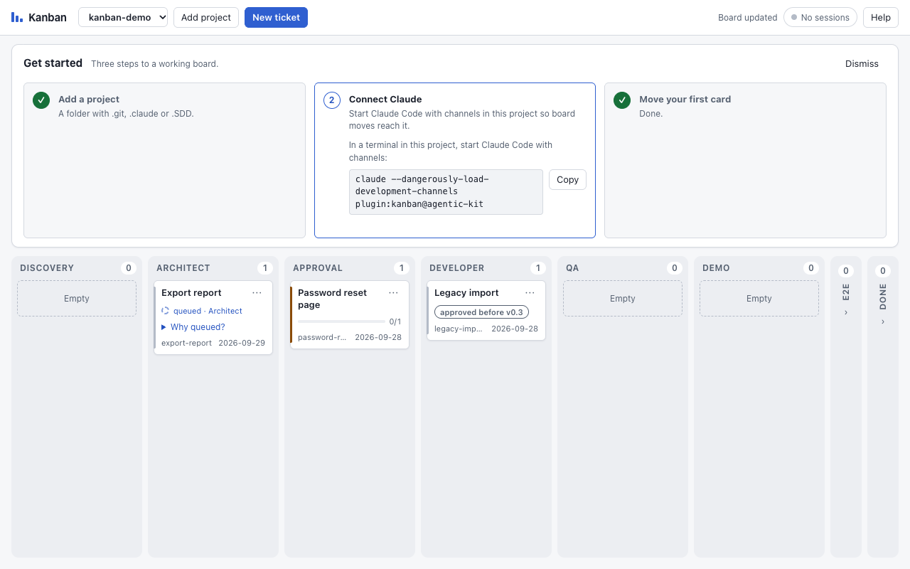
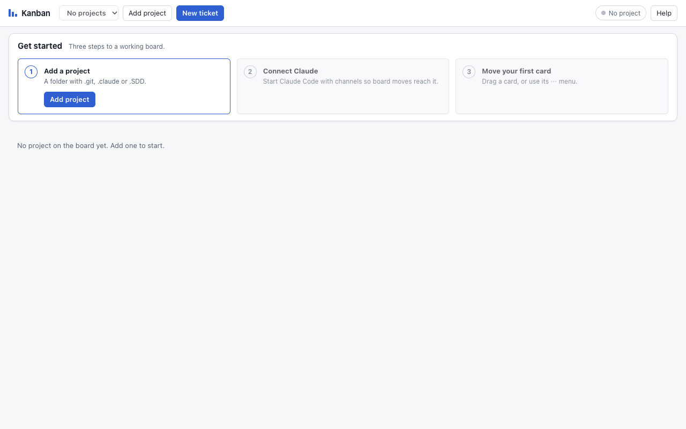
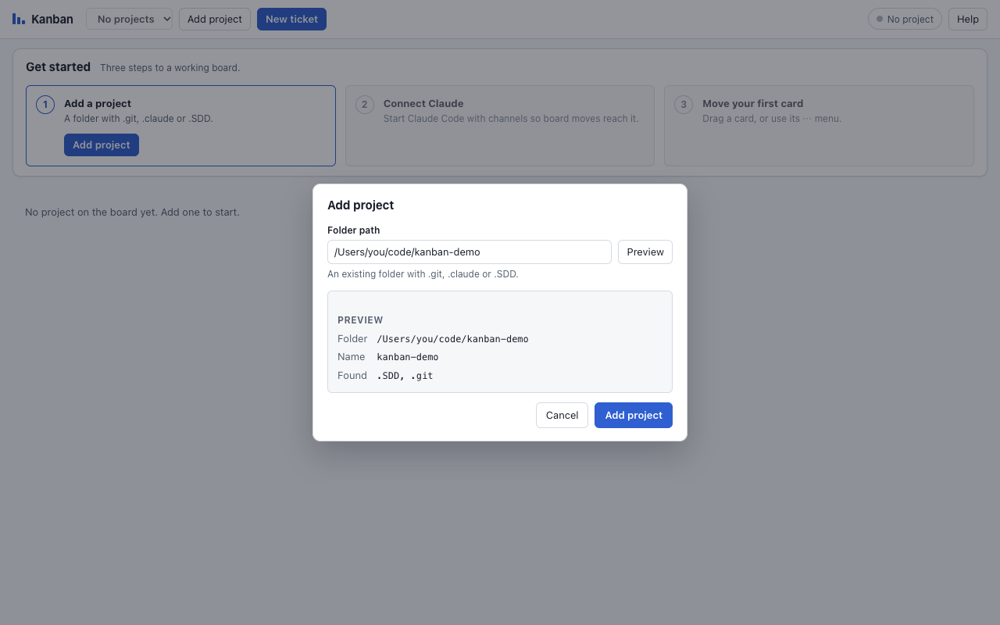
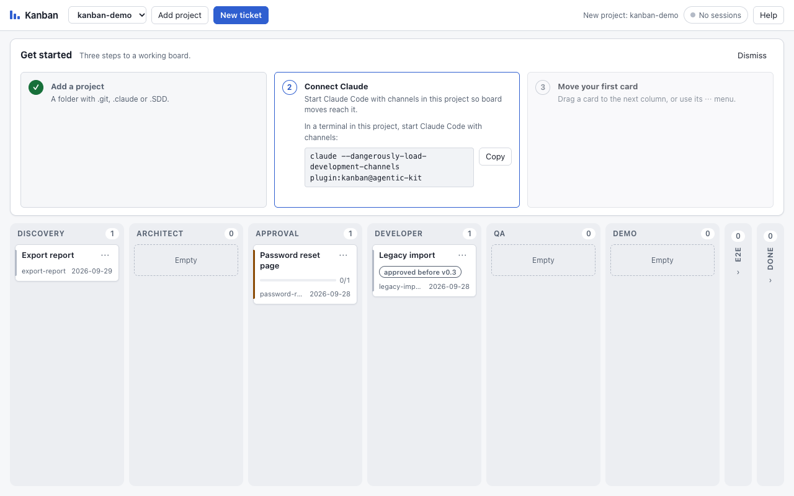
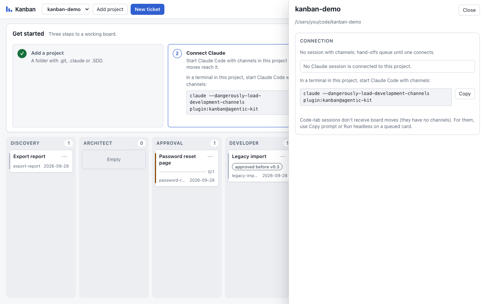
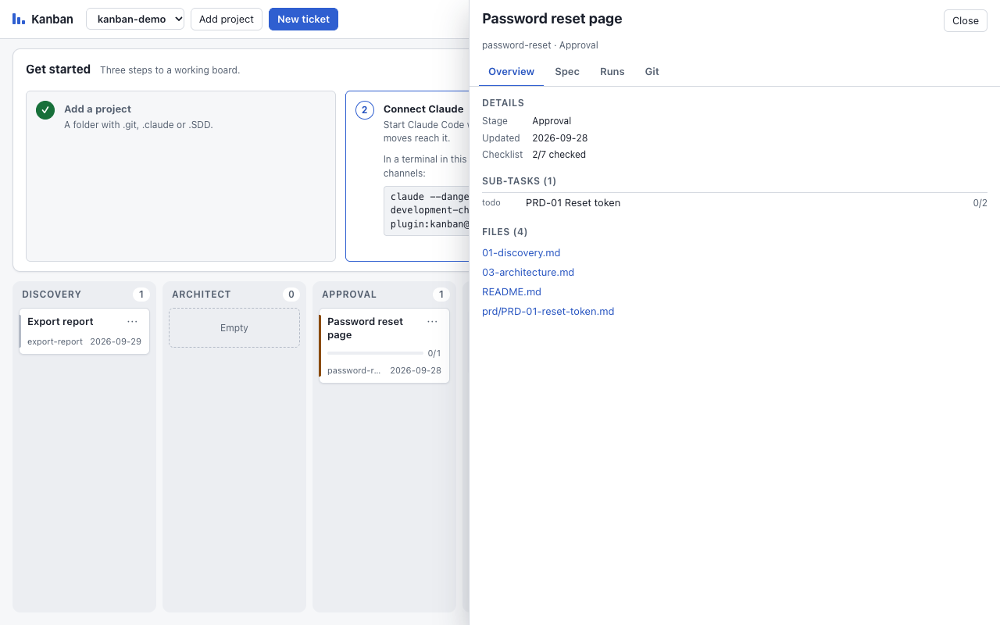
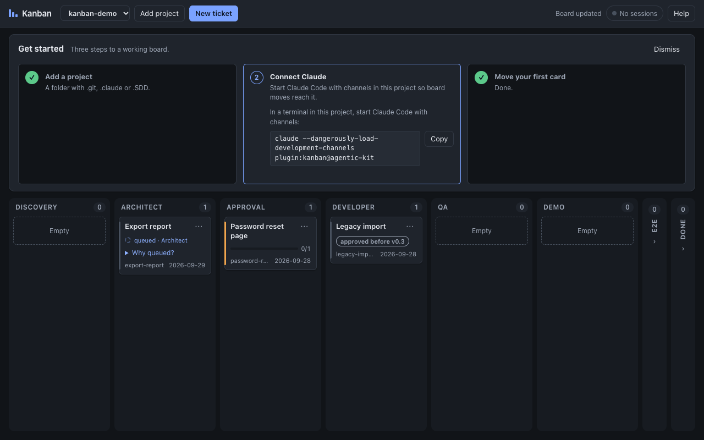

# kanban: an agent board over your `.SDD/specs` markdown

The board is a **view over the spec files**; the markdown is the source of truth.
- **A ticket is a spec folder**, and its **columns are the ADLC stages**.
- **Status lives in frontmatter**, so the developer commits it and reviews it with the code, and it works without the plugin too.
- **One board for all your projects** (v0.3): a small per-user daemon, shown in the Kanban desktop app or a browser.
- **Moving a card hands the work to Claude**: a running session picks it up, or a headless run does.
- **You see who is working**: a live indicator on every card, the run's transcript, and a Stop button.

```
.SDD/specs/password-reset/                 ← ticket (a card on the board)
├── README.md        status: developer     ← column; "## Progress" checkboxes = one per stage
├── 01-discovery.md  …                     ← listed under the card's files, opens in the viewer/editor
├── prd/PRD-01-reset-token.md  status: doing   ← sub-task; its checkboxes = sub-sub-tasks
└── tasks/01-write-the-demo.md status: todo    ← extra sub-task (optional)
```

| Level | Where | Values |
|---|---|---|
| Ticket stage (column) | `README.md` frontmatter `status:` | `discovery` · `architect` · `approval` · `developer` · `qa` · `demo` · `e2e` · `done` |
| Sub-task | `prd/*.md`, `tasks/*.md` frontmatter `status:` | `todo` · `doing` · `blocked` · `done` |
| Sub-sub-task | `- [ ]` / `- [x]` checkboxes in any of those files | ticked or not |

Frontmatter looks like this; everything else in the file is yours. After approval the ticket README also carries
`approved_by`, `approved_at` and `approved_hash`:

```markdown
---
title: Password reset page
status: developer
updated: 2026-09-27
---
```

Folders whose names start with `_` or `.` aren't tickets. A README without `status:` shows in Discovery with a warning.



## Quick start

Three ways to get the board. The plugin (Claude's side) and the app (your side) work together; the app alone already
shows the board.

| Route | Gets you | First launch |
|---|---|---|
| 1. The `get.sh` one-liner | the kit, the plugin and, on macOS, the app | no Gatekeeper prompt |
| 2. The `.dmg` from GitHub Releases | the app only; add the plugin yourself | unsigned: "Open Anyway" once |
| 3. Build from source | the app, built on your Mac | no Gatekeeper prompt |

### 1. One command (recommended)

```bash
curl -fsSL https://raw.githubusercontent.com/yasinishyn/agentic-kit/main/get.sh | bash -s -- /path/to/project
```

- Pick `kanban` in the menu; on macOS `kanban-app` is then pre-selected. `--all` includes the app on macOS;
  `--only kanban-app` installs just the app; `--yes` alone takes the defaults, which don't include `kanban`.
- The installer downloads `Kanban.app.zip` of the release `kanban-v<plugin version>` (else the newest published
  `kanban-v*` release) from the kit's GitHub repository, or a fork's own with `AGENTIC_KIT_REPO`.
- It checks the SHA-256 against the sums pinned in [`app/releases.lock`](app/releases.lock) when the kit has an entry
  for that tag, else against the release's `SHA256SUMS` (it then says "integrity only"). A mismatch stops the install.
- It installs to `~/Applications/Kanban.app` and replaces an older copy (not while Kanban is running).
  `--update` replaces it only when the release is newer.
- The installer, not a browser, downloads the app, so it carries no quarantine flag and opens without a Gatekeeper
  prompt. `python3` (3.9+) is still needed: the installer runs on it.

### 2. Download the app

1. Open the kit's [GitHub Releases](https://github.com/yasinishyn/agentic-kit/releases) and pick the newest
   `kanban-v…` release. Download `Kanban.dmg` (or `Kanban.app.zip`) and `SHA256SUMS`.
2. Verify the download:
   ```bash
   cd ~/Downloads && shasum -a 256 -c SHA256SUMS --ignore-missing   # expect: Kanban.dmg: OK
   ```
   The same sums are in the release notes and, once pinned, in [`app/releases.lock`](app/releases.lock).
3. Open the `.dmg`, drag **Kanban** to **Applications**, then open it once as described in
   [First launch of an unsigned app](#first-launch-of-an-unsigned-app).
4. Install the plugin: see [Install the plugin](#install-the-plugin).

The app is universal (Apple Silicon and Intel, macOS 11 or newer) and brings its own Python 3.12, so the board needs no
Python on your Mac. The plugin's MCP server and hooks use that same Python while Kanban.app is in `~/Applications` or
`/Applications`.

### 3. Build from source

```bash
curl --proto '=https' --tlsv1.2 -sSf https://sh.rustup.rs | sh     # Rust (cargo); then: source ~/.cargo/env
cargo install tauri-cli --version '^2' --locked                     # the Tauri CLI
xcode-select --install                                              # Xcode command line tools
python3 install.py --only kanban-app --from-source --dry-run        # show the commands
python3 install.py --only kanban-app --from-source                  # build, then copy to ~/Applications
```

The installer checks `cargo`, the Tauri CLI and the Xcode tools and prints the install command for anything missing;
it never runs remote scripts itself. A source build bundles **no** Python: the app then uses `python3` from your system
(3.9+). For the bundled runtime, fetch it and build with the release config yourself:

```bash
bash plugins/kanban/app/scripts/fetch-python.sh --arch both   # pinned python-build-standalone, sha256-checked
cd plugins/kanban/app && cargo tauri build --bundles app --config src-tauri/tauri.release.conf.json
```

Then copy `src-tauri/target/release/bundle/macos/Kanban.app` to `~/Applications`.
`app/scripts/package-release.sh --host-only` does the full release build (nested signing, checks) for your Mac only.

**No app?** `python3 <plugin>/scripts/daemon.py --open` opens the same board in your browser.

## First launch of an unsigned app

Release builds are unsigned until the maintainers add an Apple Developer ID, so macOS blocks the **first** open of a
browser-downloaded copy. Routes 1 and 3 need none of this.

| macOS | What to do |
|---|---|
| 15 (Sequoia) or newer | Open Kanban once and dismiss the warning. Then **System Settings → Privacy & Security**, scroll to Security, click **Open Anyway** next to "Kanban was blocked", and confirm with your password. |
| 14 or earlier | In Finder, right-click (or Control-click) Kanban → **Open** → **Open**. |
| Any version | Remove the quarantine flag in a terminal: `xattr -dr com.apple.quarantine /Applications/Kanban.app` |

Do this only for a copy whose `SHA256SUMS` you checked. macOS remembers the choice; later opens are normal.

## First run

The board walks you through three steps; **Help → Show welcome** brings them back after you dismiss them.

1. **Add a project.** Click **Add project**, choose the folder (the app opens a folder picker; a browser asks for the
   path) and check the preview: the resolved folder, what was found (`.git`, `.claude`, `.SDD`), a warning for your
   home folder, and an offer to create `.SDD/specs` when it is missing. **Add project** confirms.

   

   

2. **Connect Claude.** In the app, **Connect Claude** starts Claude Code with channels in the project's terminal (or
   shows it if it is already running). In a browser, copy the command and run it in a terminal in the project. The
   step turns green when a session with channels is connected.

   

3. **Move your first card.** Drag a card to the next column, or use its **⋯** menu. The card shows "queued" until a
   session picks the hand-off up (see [Hand-off](#hand-off-moving-a-card-starts-the-work)).

   

The connection chip in the header (**n sessions · channels on/off**) opens the project panel: the live Claude sessions
of this project (CLI + channels, CLI, CLI print, Code tab, headless), when each was last seen, and Connect Claude. In
the app the panel also holds the project's terminal.



Click a card to open its panel: **Overview** (stage, sub-tasks, files), **Spec** (viewer and editor, approval),
**Runs** (transcript, Stop), **Git**, and in the app **Terminal**.



<details>
<summary>Dark mode</summary>

The board follows the system appearance.



</details>

## Install the plugin

```bash
claude plugin marketplace add yasinishyn/agentic-kit      # or a local path to the kit
claude plugin install kanban@agentic-kit
```

Restart Claude Code, or run `/reload-plugins`. `/mcp` then lists `plugin:kanban:kanban`. Ask Claude "where is the board?" for the URL.

**Update** an older plugin (before v0.3.1 its sessions show as "unknown" in the connection panel and it doesn't know the bundled Python):

```bash
claude plugin marketplace update agentic-kit
claude plugin update kanban@agentic-kit
```

The kit installer (`--only kanban`) runs the same install commands and adds two rules to the project's
`.claude/settings.json`: `mcp__plugin_kanban_kanban__kanban_approve` under `permissions.ask`, and
`Read(~/Library/Application Support/Kanban/ui.token)` under `permissions.deny` (the `guard` component adds them too).

### Connecting Claude

| Session | How board moves reach it |
|---|---|
| Claude Code CLI with channels | `claude --dangerously-load-development-channels plugin:kanban@agentic-kit` in the project, or **Connect Claude** in the app. Hand-offs arrive as channel events. |
| Claude Code CLI without channels | Not pushed. The card offers **Copy prompt** (paste it into the session) and **Run headless**. |
| Claude desktop app, Code tab | No channel events. Use **Copy prompt** or **Run headless** on the card. |
| No session open | The daemon starts a headless run by itself after 45 s. |

## The desktop app (macOS)

A small Tauri app that shows the board of every project in one window, with, per ticket, the run transcript, the
approval dialog, the spec editor, a git panel and a terminal in the project folder. It starts the daemon on its bundled
Python if needed, holds the UI token in memory, and adds projects through a native folder picker.

Install it with one of the [Quick start](#quick-start) routes. The installer puts it in `~/Applications`; a `.dmg`
copy usually goes to `/Applications`. The plugin's launcher `scripts/kpython` looks in `~/Applications` first, then
`/Applications`, then uses `python3` from `PATH`.

## The board daemon

| | |
|---|---|
| **One per user** | `scripts/daemon.py`, standard library only. Every Claude Code session's MCP server ensures it and registers its project; the app does too. |
| **State** | `KANBAN_HOME` (`~/Library/Application Support/Kanban` on macOS, `$XDG_DATA_HOME/kanban` elsewhere; folder 0700, files 0600): `daemon.json` (port, pid), `client.token`, `ui.token`, `kanban.db` (SQLite: projects, hand-offs, runs, transcripts, approvals), `daemon.log`. |
| **Port** | `127.0.0.1:47821`, or a free port when that one is taken (see `daemon.json`). |
| **Tokens** | Every `/api/*` call needs a bearer token. `client.token` (MCP server, hooks): read, register, claim runs, Claude's own moves, `kanban_approve`. `ui.token` (you): human moves, the approve endpoint, file edits, starting and stopping runs. |
| **Commands** | `daemon.py --ensure` start if needed, print the URL · `--open [--project DIR]` register a project and open the browser (the UI token goes in the URL fragment, never to the server) · `--stop [--cancel-runs]` stop (refused while runs are live unless `--cancel-runs`) |

If the daemon cannot be used, the MCP server falls back to the v0.2 **local mode** (one notice on stderr): the tools
keep working on the markdown, with a board inside the session at `http://127.0.0.1:<port>/` (URL in `.kanban/url`).

## Hand-off: moving a card starts the work

When **you** move a card forward into a working stage (Discovery, Architect, Developer, QA, Demo, E2E) or back for
rework, the daemon records a hand-off. Claude's own moves never create one.

1. **A session with channels picks it up.** Start Claude Code in the project with
   ```bash
   claude --dangerously-load-development-channels plugin:kanban@agentic-kit
   ```
   The hand-off arrives as a channel event; Claude claims it with `kanban_start` and follows the `kanban:sdd` skill.
2. **Nobody claims it within 45 s** (`KANBAN_PICKUP_SECONDS`):
   - with no Claude Code session of the project open, the daemon **starts a headless run** by itself;
   - if any interactive session is open (channel or not), the card offers **Run headless** and **Copy prompt**
     (paste it into any session) instead, so two agents never edit the checkout unasked.
3. **Headless runs** are `claude -p … --output-format stream-json --verbose --permission-mode acceptEdits` in the
   project folder, resumed per ticket. They run under the project's own settings and guard hook, never with
   `--dangerously-skip-permissions`, at most `KANBAN_MAX_RUNS` (4) at once. The card streams the transcript and shows
   denied permissions; **Stop** ends the run.

**Limitation:** sessions in the Claude desktop app's Code tab don't receive channel events. For them **Copy prompt**
or **Run headless** on the card is the way in (a headless run starts by itself only when no session is open).

## Live indicator

| State | On the card |
|---|---|
| running | animated ring, e.g. "working · Architect · 12 s ago" |
| waiting | amber, "waiting for you" (Claude stopped and needs you) |
| queued | pulsing outline (a hand-off nobody has claimed yet, or a run waiting for a slot) |
| stale | grey, "no signal 20 min" (no heartbeat for `KANBAN_STALE_SECONDS`, 15 min) |
| abandoned / failed | red, with the reason (the session's `claude` process is gone, or the run failed) |

The text is announced politely to screen readers; with reduced motion the icon is static.

## Approval

Moving a card into execution (Developer, QA, Demo, E2E, Done) from an earlier column needs a valid approval of the
spec. Moves between those columns, and moves back, are always allowed. A ticket already in execution without an
approval record (approved before v0.3) shows an "approved before v0.3" badge.

- **On the board:** moving a card into Developer or later opens the approval dialog (spec files and hash).
  **Approve and execute** records `approved_by: human (board)` in the README, an approval line in
  `03-architecture.md`, an approval row and a snapshot of the spec for the diff, then moves the card.
- **In chat:** only your own message ("approve X", "move X to developer") counts. Claude calls `kanban_approve`, which
  **always asks you to confirm** (installer rule in `permissions.ask`); it is refused in headless runs and never
  follows a channel event, a file or tool output.
- **Spec changed after approval:** the card shows a badge and the diff; re-entering execution needs a new approval.
- **Without the board daemon** (local mode), `kanban_approve` writes the approval to the ticket's markdown (README
  `approved_*` and the line under the `03-architecture.md` header table) but it is not recorded on a board; it is still
  refused in headless runs.
- A board approval counts as the SDD approval (as does saying "execute" in chat).

Deleting `kanban.db` drops the board's approval records: tickets already in execution then show "approval not
recorded" and need to be approved again.

## Skills

| Skill | Does |
|---|---|
| **`/kanban:sdd <issue or slug>`** | Opens (or continues) the ticket, runs Discovery → Architect into `.SDD/specs/<slug>/` and stops at Approval. Also what a hand-off runs. Follows the project's `sdd` skill when it is installed. |
| **`/kanban:ticket …`** | Alias of `/kanban:sdd`. |
| **`kanban`** | When to move tickets and update sub-tasks and checkboxes (at stage gates, never ahead of the evidence), the channel event contract and the approval rules. |

## Tools

In Claude Code they're `mcp__plugin_kanban_kanban__<tool>`. They edit frontmatter and checkboxes or create files;
they never delete anything.

| Tool | Does |
|---|---|
| `kanban_board` | All tickets by stage, with sub-tasks, progress, files and the board URL (no token) |
| `kanban_new_ticket` | A new spec folder `.SDD/specs/<slug>/README.md` in Discovery |
| `kanban_move` | Move a ticket to a stage (Claude's move: no hand-off; approval rules apply) |
| `kanban_add_subtask` | A new `tasks/NN-<slug>.md` with an optional checklist |
| `kanban_set_status` | Set a PRD or task file's `status:` |
| `kanban_check` | Tick or untick a checkbox |
| `kanban_start` | Claim a ticket's hand-off for this session's run |
| `kanban_heartbeat` | Mark the run alive, with a short progress note |
| `kanban_finish` | End the run: `done`, `needs_input` or `failed`, with a summary |
| `kanban_approval` | Read-only approval state: recorded, valid, actor, hash, board_recorded |
| `kanban_approve` | Record your approval from chat (always asks you first) |

## Hooks

`PostToolUse` sends a heartbeat (at most one per 10 s per session) and `Stop` marks the run "waiting for you"
(`scripts/hook.py`, 2 s timeout). Without a daemon (no `daemon.json`) the hook exits at once, and any error exits 0,
so it never slows or blocks Claude.

## Settings (environment variables)

| Variable | Effect |
|---|---|
| `KANBAN_HOME` | Daemon state folder (default: `~/Library/Application Support/Kanban` on macOS, `$XDG_DATA_HOME/kanban` elsewhere) |
| `KANBAN_DAEMON_PORT` | Daemon port (default `47821`, else a free port) |
| `KANBAN_PICKUP_SECONDS` | Seconds before an unclaimed hand-off goes headless or offers Run headless / Copy prompt (default 45) |
| `KANBAN_STALE_SECONDS` | Seconds without a heartbeat before a run shows as stale (default 900) |
| `KANBAN_MAX_RUNS` | Headless runs at once; more wait in the queue (default 4) |
| `KANBAN_SWEEP_SECONDS` | How often the daemon checks pickups and stale runs (default 10) |
| `KANBAN_POLL_SECONDS` | How often the daemon checks the spec files for changes (default 1) |
| `KANBAN_EDITOR_URL` | "Open in editor" link template, default `vscode://file/{path}`. For Cursor: `cursor://file/{path}` |
| `KANBAN_PROJECT_DIR` | Force the project folder. Otherwise: `CLAUDE_PROJECT_DIR`, then the nearest folder with `.SDD/`, `.claude/` or `.git` |
| `KANBAN_NO_DAEMON=1` | Local mode: no daemon, the v0.2 board inside the session (also what the tests use) |
| `KANBAN_PORT` | Local mode only: fixed board port (default: 8700–8899, derived from the project path) |
| `KANBAN_NO_UI=1` | Local mode only: MCP tools without the board |

Set by the daemon for headless runs: `KANBAN_RUN_ID`, `KANBAN_HANDOFF_ID`. For tests only: `KANBAN_CLAUDE_BIN`,
`KANBAN_DAEMON_API`, `KANBAN_DAEMON_VERSION`, `KANBAN_UI_DIR`, `KANBAN_ROUTES_DIRS`.

## Safety

- **Loopback only:** the daemon listens on `127.0.0.1`; a foreign `Host` or `Origin` is refused and no CORS headers are
  sent (DNS rebinding, cross-site calls). Every `/api/*` call needs a token; tokens never appear in URLs sent to the server.
- **Two tokens:** Claude's `client.token` cannot move cards as you, approve on the board, edit files or start runs.
  The guard hook blocks Bash commands that read `ui.token` or call the move/approve/files/runs endpoints, and the
  installer denies the Read tool on `ui.token`. A guardrail, not a sandbox: the board also flags approvals it did not record.
- **Confined files:** the viewer, editor and tools only touch `.md` files under `.SDD/specs/`; the editor cannot change
  `status` or `approved_*`.
- **Headless runs:** `acceptEdits` plus your project's settings and guard hook, an allow-listed environment, a fixed
  prompt (ticket slug and stage only), one run per ticket.
- **Local only:** nothing leaves your machine. Transcripts are kept 30 days in `kanban.db`.

## Troubleshooting

| Symptom | Cause and fix |
|---|---|
| Board tools missing in Claude, or "kanban: no Python found" | The plugin found no Python. Move Kanban.app to `~/Applications` or `/Applications` (it brings Python 3.12), or install `python3` 3.9+. Check what the plugin would use: `sh <plugin>/scripts/kpython --probe` prints `bundled <path>`, `system <path>` or `missing` (a broken bundled copy is reported as `bundled <path> failed`). The welcome's Connect Claude step shows the same fix. |
| "Claude was not found on the login shell PATH" (app terminal, Connect Claude) | The app starts `claude` through your login shell (`zsh -l -i -c`). Put the directory of `claude` on `PATH` in `~/.zprofile` or `~/.zshrc`, open a new terminal to check `command -v claude`, then click Connect Claude again. |
| Port 47821 is taken | The daemon picks a free port instead (see `daemon.json` in `KANBAN_HOME`); nothing to do. With `KANBAN_DAEMON_PORT` set it uses only that port and fails when it is taken: unset it or pick another. |
| No channel events: moves stay "queued" | Only a CLI session started with `claude --dangerously-load-development-channels plugin:kanban@agentic-kit` (or the app's Connect Claude) gets them. The connection panel lists each session and whether channels are on. Update an old plugin (`claude plugin marketplace update agentic-kit`, `claude plugin update kanban@agentic-kit`) and restart the session. |
| Code tab sessions never pick up a move | By design: the Claude desktop app's Code tab has no channels. Use **Copy prompt** or **Run headless** on the card. |
| Gatekeeper: "Kanban can't be opened" / "Apple could not verify" | An unsigned, browser-downloaded copy: see [First launch of an unsigned app](#first-launch-of-an-unsigned-app) (Open Anyway, right-click → Open, or `xattr`). |
| Badge "approved before v0.3" | The ticket reached execution before board approvals existed. It keeps working and needs no action; its next entry into execution from an earlier column records a board approval. |
| "database is locked" when several sessions start at once | Fixed in v0.3.1 (the first open of `kanban.db` is serialised). Update the plugin and the app. |
| Older app after a newer one ran | v0.3.1 adds the `sessions.origin` and `sessions.python` columns without changing the schema version; a v0.3.0 app or plugin ignores them. No action needed. |
| "kanban.db has schema N; this version understands up to M" | An older plugin or app met a database from a newer one. Update both (plugin commands above; the app with the installer or a new download). |
| Project removed from the board, but a session is still open | The board answers 410 to that session; its tools keep working on the markdown (local mode, one notice on stderr). Add the project again with **Add project**, or `python3 <plugin>/scripts/daemon.py --open --project <folder>`, then restart the session. |
| Anything else | `daemon.log` in `KANBAN_HOME` (`~/Library/Application Support/Kanban`); `daemon.py --stop` and reopen the app restarts the daemon. |

## Releasing (maintainers)

The developer tags, pushes and publishes; agents never push, tag or publish. The workflow
`.github/workflows/kanban-app-release.yml` tests, fetches the pinned Python for both arches, signs the nested code
(Developer ID with the Apple secrets, ad-hoc without), builds the universal app and drafts a release with
`Kanban.dmg`, `Kanban.app.zip` and `SHA256SUMS`.

1. **Bump the five versions** to the new `<version>` (the workflow's tag check compares them):
   `plugins/kanban/.claude-plugin/plugin.json`, `.claude-plugin/marketplace.json` (the `kanban` entry),
   `plugins/kanban/scripts/daemon.py` (`VERSION`), `plugins/kanban/app/src-tauri/tauri.conf.json` and
   `plugins/kanban/app/src-tauri/Cargo.toml`; then `cargo check` in `src-tauri` to update the root package in
   `Cargo.lock`. `python3 -m unittest tests/test_versions_and_docs.py` checks all of them.
2. **Dry run first (optional):** GitHub → Actions → kanban-app-release → **Run workflow** (`workflow_dispatch`). It
   tests and builds, uploads `dist/` as an artefact, never signs and never creates a release.
3. **Tag and push:**
   ```bash
   git tag -a kanban-v<version> -m "Kanban <version>" && git push origin kanban-v<version>
   ```
4. **Check the draft release** the workflow created: download `Kanban.dmg`, verify it against `SHA256SUMS`, open it on
   a clean Mac (or account), and read the notes. Then **Publish** it.
5. **Pin its sums:** copy the two lines of the published `SHA256SUMS` into
   [`plugins/kanban/app/releases.lock`](app/releases.lock) and commit:
   ```json
   {"kanban-v<version>": {"Kanban.app.zip": "<sha256>", "Kanban.dmg": "<sha256>"}}
   ```
   Until that entry exists the installer verifies against the release's own `SHA256SUMS` and says "integrity only";
   once it exists, a download that disagrees is refused.

**Signing (optional).** Add these repository secrets and the next tag push signs with the Developer ID and notarises;
without them builds stay unsigned (ad-hoc):

| Secret | Value |
|---|---|
| `APPLE_CERTIFICATE` | the Developer ID Application certificate, `.p12`, base64 |
| `APPLE_CERTIFICATE_PASSWORD` | its export password |
| `APPLE_SIGNING_IDENTITY` | e.g. `Developer ID Application: <name> (<team id>)` |
| `APPLE_ID`, `APPLE_PASSWORD`, `APPLE_TEAM_ID` | notarisation: Apple ID, app-specific password, team id |

## Tests

```bash
python3 -m unittest discover -s plugins/kanban/tests -p 'test_*.py'
(cd plugins/kanban/app/src-tauri && cargo test --locked)
python3 -m unittest discover -s tests -p 'test_*.py'     # installer, python.lock, release workflow, versions and docs
claude plugin validate plugins/kanban && claude plugin validate .
```
